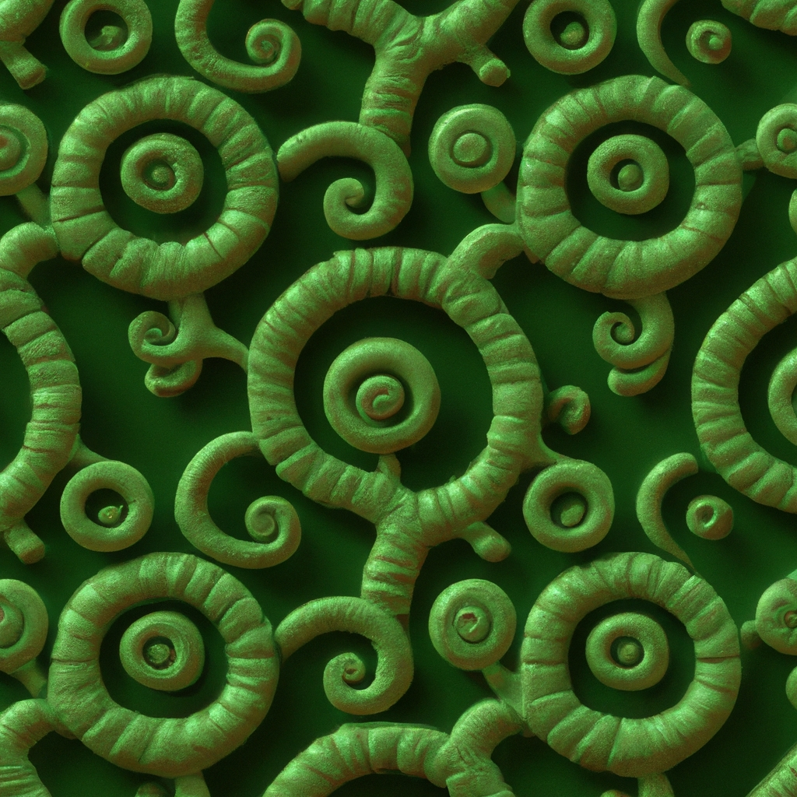

# Create you own AI art 

<br>

## App overview

Ai is the hottest trend in tech right now. I built a python app that uses the OpenAI api to generate images based on user prompts. Streamlit is a nice <br>
framework that gets your app running and be able to share instantly. However, in the future I might use a better/mature web framework for this application like Django or Node.js in order to add some cool features and better styling.

<br>


## Packages

see `requirements.txt` file or look at list below:

```python
openai==0.26.0
Pillow==9.4.0
requests==2.28.1
streamlit==1.16.0
```

<br>


## Setups

1. To run app make sure you get your free Openai Api keys here: https://openai.com/api/, replace line 19 in the `app.py` file with your keys.<br>
    it should be `openai.api_key = "<YOUR API KEY>"`. Make sure you use `st.secrets` before pushing your code to a public repo to hide your keys.<br>
    <br>
2. To run app, install required packages `pip3 install -r requirements.txt`
3. Run app `streamlit run app.py`
4. The default port for streamlit is Port:8501

<br>


## Image prompts

Open Ai uses trained datasets to create images based on your description. To get a better image be sure to be descriptive. tips on prompts below. This website will give some ideas on how to write better prompts for the ai: https://tinyurl.com/2pwzzsg5 

```
a seamless tileable jade tree pattern, spiral carvings, octane renderer, trending on CGsociety --ar 1:1 --q 2

```




<br>


## Demo


VISIT 👉 <a href="https://tinyurl.com/2k6q3ulc" target="_blank">App Site</a>